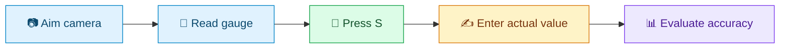

<a id="top"></a>

<div align="center">

# 🔍 Industrial Gauge Reader

### Point. Capture. Measure.

**Analog dials → live readings → measurable accuracy**


[🚀 Get started](#setup-and-run) · [🎮 Controls](#live-controls) · [📸 Capture](#capture-an-accuracy-dataset) · [📊 Evaluate](#run-accuracy-evaluation) · [🧭 Read results](#understand-the-reports)

</div>

Read UNIJIN and Badotherm analog pressure gauges with a webcam, capture clean
photos and live readings, and compare predictions against manually entered
reference values.

| I want to… | Start here |
|---|---|
| See a live gauge reading | [Launch the reader](#setup-and-run) |
| Record the exact displayed value | [Press S and label the sample](#capture-an-accuracy-dataset) |
| Find my accuracy percentage | [Evaluate live readings](#run-accuracy-evaluation) |
| Understand an error or a failed sample | [Report guide](#understand-the-reports) · [Troubleshooting](#troubleshooting) |



*Preview this file with **Ctrl + Shift + V** in VS Code or view it on GitHub.
Expandable sections work in compatible Markdown viewers; diagram rendering depends on Mermaid support.*

---

## Supported gauges

| Gauge | Primary scale | Secondary scale | Default evaluation tolerance |
|---|---|---|---|
| UNIJIN | 0–150 PSI | 0–10 kgf/cm² | ±3 PSI |
| Badotherm | −1–15 bar | −14.5–217.5 PSI | ±0.32 bar |

Default tolerance is **2% of the measuring span** (`maximum − minimum`).
This is the project's testing criterion, not an industry certification.

## Setup and run

**Your first reading in three steps: install → configure → launch.**

Requirements: Python 3.10+, a webcam, and a Roboflow API key. Open a terminal
in the project directory and install the dependencies:

```powershell
python -m pip install -r requirements.txt
```

Create `.env` in the project directory:

```env
ROBOFLOW_API_KEY=your_api_key_here
```

Start the live reader:

```powershell
python main_dual_gauge_reader.py
```

Model loading may require network access and an initial download. Gauge profiles,
model IDs, and detection settings are defined in `config.py`.

## Live controls

Use these keys while the OpenCV window has focus. Uppercase and lowercase work.

| Key | Action |
|---|---|
| <kbd>S</kbd> 📸 | Save a clean photo and the valid displayed primary reading to the active gauge dataset |
| <kbd>V</kbd> 📷 | Switch camera between configured inputs |
| <kbd>G</kbd> 🔄 | Switch gauge profile between UNIJIN and Badotherm |
| <kbd>L</kbd> 🔒 | Lock detector center and needle angle |
| <kbd>C</kbd> 🔓 | Unlock and reacquire the detector |
| <kbd>Q</kbd> 🚪 | Quit |

<details>
<summary><strong>🔬 Under the hood — how a needle becomes a number</strong></summary>


The reader uses separate gauge and needle models, computer-vision fallbacks,
angle-to-value conversion, and temporal filtering. Detection fallbacks include
box-focused Hough lines, PCA, pointer geometry, a box-vector fallback, and
full-face Hough detection. If the gauge model is unavailable, the reader uses
computer vision to locate the center.

Tracking uses fresh observations to stabilize readings. Camera switching resets
cached observations and locks; gauge switching resets tracking for the new
profile. Out-of-range angles trigger a visual warning and, where available, a
Windows notification sound.

</details>

## Capture an accuracy dataset

1. Select the correct profile with **G** and align the gauge in the camera view.
2. Press **S** for each sample. A green saved message appears for two seconds.
3. After the session, open the corresponding labels CSV and enter the actual
   readings in `expected`.
4. Save as CSV. Close Excel before taking more snapshots because it may lock the file.

| Profile | Photos | Labels |
|---|---|---|
| UNIJIN | `accuracy_data/unijin_photos/` | `accuracy_data/unijin_labels.csv` |
| Badotherm | `accuracy_data/badotherm_photos/` | `accuracy_data/badotherm_labels.csv` |

Folders and headers are created automatically. Photos are named
`unijin_YYYYMMDD_HHMMSS.jpg` or `badotherm_YYYYMMDD_HHMMSS.jpg`. A numeric suffix
prevents overwriting captures taken within the same second.

Photos contain the original camera frame without overlays. Capturing does not
change tracking state, locks, or filter histories. Saving uses synchronous local
file I/O; its duration depends on the disk and image size.

<details open>
<summary><strong>📝 CSV guide — what you enter vs. what the computer saves</strong></summary>

```csv
image,expected,live_predicted
unijin_photos/unijin_20260930_113527.jpg,120,116.25
```

- `image`: path relative to the labels CSV.
- `expected`: your independent actual reading, in **PSI for UNIJIN** or **bar for Badotherm**.
- `live_predicted`: the valid primary reading displayed when S was pressed,
  saved to the same two decimal places as the display.

The app leaves `expected` blank for you to fill. Do not copy the computer's
prediction into this column. Locking, invalid, or absent readings leave
`live_predicted` blank. Existing two-column CSVs are upgraded on the next
snapshot while preserving labels; older live predictions cannot be recovered.

Fill every `expected` cell or remove unused rows, including example rows such as
`../Unijin.jpg,,`. Labels from a human dial reading measure agreement with that
reading; labels from a calibrator also include the physical gauge's error.

</details>

<details>
<summary><strong>✅ Before evaluating — session checklist</strong></summary>

- [ ] Selected the correct gauge profile before capture.
- [ ] Entered an independent actual value in every `expected` cell.
- [ ] Used PSI for UNIJIN or bar for Badotherm.
- [ ] Filled or removed unused example rows.
- [ ] Saved the CSV; kept `live_predicted` as recorded.
- [ ] Included varied pressure levels and conditions for a meaningful test.

*Use this as a checklist; whether boxes are editable depends on your Markdown viewer.*

</details>

## Run accuracy evaluation

In VS Code, choose **Terminal → New Terminal** and run the full command from the
project directory. **Run Code** alone does not supply the required arguments.

| Choose your test | What it measures | Models needed? |
|---|---|---|
| **Live readings** — `--live` | Values displayed when you pressed S | No |
| **Photo analysis** — omit `--live` | Fresh predictions from saved photos | Yes |

### Evaluate the readings recorded during capture

```powershell
python evaluate_accuracy.py accuracy_data/unijin_labels.csv --profile UNIJIN --live
python evaluate_accuracy.py accuracy_data/badotherm_labels.csv --profile Badotherm --live
```

`--live` compares saved `live_predicted` values with `expected`. It does not load
models, open a camera, or reprocess photos. The current configuration still
requires the existing API key.

<details>
<summary><strong>🖼️ Alternative: evaluate photos independently</strong></summary>

```powershell
python evaluate_accuracy.py accuracy_data/unijin_labels.csv --profile UNIJIN
python evaluate_accuracy.py accuracy_data/badotherm_labels.csv --profile Badotherm
```

Without `--live`, each image gets a fresh prediction using the detection models.
This does not use live tracking history, smoothing, or manual locks, so its
results may differ from the captured display values.

</details>

### Your pass/fail rule

Both modes default to **±2% of span**: **±3 PSI** for UNIJIN and **±0.32 bar** for
Badotherm. A sample passes when its absolute error is at most this tolerance,
including the boundary.

> **Worked example:** UNIJIN actual reading = **100 PSI**.
> Predictions from **97 to 103 PSI** pass. A reading of **105 PSI** fails.
>
> Badotherm actual reading = **1.30 bar**.
> Predictions from **0.98 to 1.62 bar** pass.

<details>
<summary><strong>⚙️ Advanced: tolerance overrides, validation, and output folders</strong></summary>

`--tolerance` is an optional override in **primary units, not percent**.
For example, `--tolerance 2` means ±2 PSI for UNIJIN or ±2 bar for Badotherm.
Omit it to retain the 2%-of-span default.

```powershell
# Check labels and recorded live values without creating a report
python evaluate_accuracy.py accuracy_data/unijin_labels.csv --profile UNIJIN --live --check-only

# Check labels and image decoding without loading detection models
python evaluate_accuracy.py accuracy_data/unijin_labels.csv --profile UNIJIN --check-only

# Show supported profiles or command options
python evaluate_accuracy.py --list-profiles
python evaluate_accuracy.py --help
```

Use `--output folder_name` to select a different results directory.

</details>

## Understand the reports

### Where is my accuracy percentage?

Open **`summary.json` → `accuracy_rate_percent`**.

**Illustrative report excerpt — not a measured result from this project:**

```json
{
  "accuracy_rate_percent": 80.0,
  "accuracy_rate_explanation": "4 out of 5 readings were accurate within +/- 3 PSI of your actual readings. Missing or invalid readings count as not passing.",
  "tolerance": 3.0,
  "unit": "PSI",
  "tolerance_basis": "2% of gauge span",
  "tolerance_percent_of_span": 2.0
}
```

**✅ ✅ ✅ ✅ ❌ → 4 / 5 passed → 80% within tolerance**

Each evaluation creates a timestamped folder under `accuracy_results/`:

| File | Contents |
|---|---|
| `summary.json` | Accuracy percentage, plain-English explanation, tolerance, and metrics |
| `readings.csv` | Actual value, prediction, absolute error, status, and pass/fail for each sample |
| `0001_overlay.jpg`, etc. | Detection overlays on decoded images in photo mode only |

The JSON starts with `accuracy_rate_percent` and `accuracy_rate_explanation`.
For example, **80% means 4 of 5 samples passed the chosen tolerance**. It does
not mean that every predicted value is “80% correct.”

<details open>
<summary><strong>📐 Metric decoder — MAE, RMSE, bias, and pass rate</strong></summary>

| JSON field | Meaning |
|---|---|
| `accuracy_rate_percent` | Percentage of all samples within tolerance |
| `tolerance` | Allowed absolute error in the gauge's primary units |
| `tolerance_basis` | Default: `2% of gauge span` |
| `tolerance_percent_of_span` | Default: `2.0` |
| `easy_to_read` | Plain-English interpretation of results |
| `accuracy_metrics.MAE` | Average absolute error; lower is better |
| `accuracy_metrics.RMSE` | Error measure giving larger mistakes more weight |
| `accuracy_metrics.bias` | Average prediction minus actual; negative means reading low |
| `accuracy_metrics.maximum_absolute_error` | Largest absolute error |
| `accuracy_metrics.pass_rate` | Same percentage as `accuracy_rate_percent` |
| `accuracy_metrics.usable_reading_rate` | Percentage that could be evaluated; this is not accuracy |

</details>

<details>
<summary><strong>🧮 How missing readings and failures affect the score</strong></summary>

Each metric includes its value, unit, and explanation. Error metrics use only
usable readings; pass rate includes all samples. Missing or invalid live
predictions and photo-processing failures count as not passing. Blank or
nonnumeric `expected` values stop evaluation until corrected. With no usable
readings, error metrics are `null`, not zero.

A successful evaluation exit code means at least one reading was usable, not
that every sample passed. All-invalid evaluations return exit code 1.

</details>

Collect independent samples across pressure levels, lighting, camera angles,
and separate sessions. Repeated snapshots of one tracked reading provide
limited evidence. Keep final evaluation samples separate from those used for
calibration. See [ACCURACY_TESTING.md](ACCURACY_TESTING.md) for further details.

## Troubleshooting

<details open>
<summary><strong>🛠️ Something went wrong? Find the message below</strong></summary>

| Message or issue | What to do |
|---|---|
| `labels CSV and --profile are required` | Run the complete evaluation command in the terminal |
| `Line N: expected must be a number` | Fill that row's actual reading, or remove an unused example row, then save |
| `CSV has no live_predicted column` | Capture new samples with the updated reader; old live values are unavailable |
| Blank `live_predicted` | Capture when a valid reading is displayed; blanks count as failed samples in live evaluation |
| Snapshot CSV append failed | Check the console details and close Excel; a saved photo may still be available for recovery |

</details>

## Project files

<details>
<summary><strong>🗂️ Explore the project map</strong></summary>

```text
Gauge-Reader/
├── main_dual_gauge_reader.py  # Live application and keyboard controls
├── dataset_snapshot.py       # Clean JPEG capture and CSV appending/migration
├── evaluate_accuracy.py      # Live-value and independent-photo evaluation
├── calibrate_gauge.py        # Interactive angle calibration
├── config.py                 # Gauge profiles, model IDs, API configuration
├── camera.py                 # Camera opening and fallback
├── detection.py              # Center and needle detection
├── measurement.py            # Angle conversion and filtering helpers
├── tracking.py               # Tracking state and locks
├── test_measurement.py
├── test_tracking_updates.py
├── test_dataset_snapshot.py
├── test_evaluate_accuracy.py
├── accuracy_data/            # Photos and ground-truth labels
├── accuracy_results/         # Generated reports
├── ACCURACY_TESTING.md
├── DATASET_SNAPSHOT_SPEC.md   # Original snapshot feature specification
├── requirements.txt
└── .env                     # Local API key; do not commit
```

</details>

## Calibration and new profiles

<details>
<summary><strong>🔧 Tune a gauge profile or add your own</strong></summary>

Run `python calibrate_gauge.py`. Align the camera squarely with the dial, use
`0` to record the minimum-scale angle, `m` for the maximum-scale angle, and `p`
to print the profile settings. Follow the calibration tool's own displayed
controls; its camera-switch key differs from the live reader.

Add or update the profile in `config.py`, then select it with G in the live
reader. For a new gauge, set both scale endpoints and units consistently.
Snapshot routing currently supports UNIJIN and Badotherm only; extend
`dataset_snapshot.py` to capture another gauge profile.

</details>

## Run code tests

Install pytest if it is not already available, then run:

```powershell
python -m pip install pytest
python -m pytest -q
```

The tests cover measurement math, tracking, camera switching, dataset snapshots,
CSV compatibility, and evaluation metrics using synthetic data and mocked
hardware/models. They verify implementation behavior. To measure accuracy on
your actual gauges, run `evaluate_accuracy.py` with completed labels.

---

<div align="center">

**Capture clean frames. Record real values. Measure the difference.**

[Back to top ↑](#top) · [Detailed testing guide](ACCURACY_TESTING.md)

</div>
