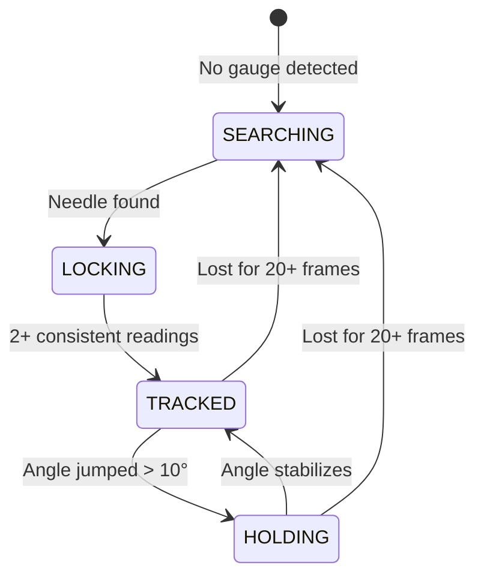

<div align="center">

# 🔍 Industrial Gauge Reader

### Turn any analog pressure gauge into a digital sensor — with just a camera.

[](https://python.org)
[](https://opencv.org)
[](https://roboflow.com)
[](#-running-tests)

---

**No hardware modification** · **Real-time readings** · **Multi-gauge support** · **4-tier detection fallback**

</div>

## 🎯 What Does This Do?

Point a webcam at an analog pressure gauge → get live digital readings on screen.

```
┌─────────────┐     ┌──────────────┐     ┌──────────────┐     ┌─────────────┐
│  📷 Camera  │ ──▶ │  🤖 ML Model │ ──▶ │  📐 CV Math  │ ──▶ │  📊 Reading │
│   Feed      │     │   Detection  │     │   Analysis   │     │   Display   │
└─────────────┘     └──────────────┘     └──────────────┘     └─────────────┘
```

> **Example**: A UNIJIN gauge showing ≈72 PSI → the system detects the dial, locks the center, traces the needle, and displays `PSI: 72.14` in real time.

---

## 🧠 How It Works

The system uses a **4-stage pipeline** with intelligent fallbacks:


<details>
<summary><b>🔬 Stage 1 — Gauge Detection</b> (ML Model)</summary>
<br>

A Roboflow-trained model scans the camera frame and returns bounding boxes for the gauge dial and needle. This gives us a rough location to work with.

</details>

<details>
<summary><b>⭕ Stage 2 — Center Locking & Tracking</b> (Hough Circles + Manual 'L' Lock)</summary>
<br>

Dial center detection uses multi-pass Hough circles constrained by mutual co-location with the needle bounding box, plus contour fallback.
- **Auto-Lock**: Locks when consecutive frame candidates have a spread ≤ 35px.
- **Manual Lock (`L`)**: Instantly freeze the detected candidate center without waiting.
- **Unlock (`C`)**: Reset the locked center and resume dynamic candidate acquisition.

```
Candidate detected: (352, 556)  →  "CENTER: ACQUIRING [Press 'L' to lock]"
User presses 'L':               →  "CENTER: MANUAL LOCK [Press 'C' to unlock]"
```

</details>

<details>
<summary><b>📌 Stage 3 — Needle Detection & Longer Pointer Resolution</b></summary>
<br>

Analog needles typically have a **longer pointer** reaching towards the dial scale and an **opposite shorter counterweight/tail**. The detection engine strictly resolves the longer needle branch:

| Strategy | Method | Purpose |
|:--------:|--------|---------|
| 🥇 | **Box-focused Hough lines** | Detects line segments inside needle ROI, scoring by radial reach from hub |
| 🥈 | **PCA eigenvector fitting** | Dark-pixel principal axis fit, selecting the farther endpoint |
| 🥉 | **Pointer geometry vector** | Extracts hub-to-tip segment from bounding box features |
| 🛡️ | **Opposite tail rejection** | Filters out shorter counterweights (115°–180° opposite) to ensure the true pointer is read |

</details>

<details>
<summary><b>📊 Stage 4 — Stabilized Reading</b> (State Machine)</summary>
<br>

Raw angle readings are noisy. The tracking state machine smooths them:



The `TRACKED` state applies a **low-pass filter** (`0.20 × delta`) — smooth enough to kill jitter, fast enough to follow real needle movement.

</details>

---

## 🎛️ Supported Gauges

| Gauge | Primary Scale | Secondary Scale | Status |
|:------|:-------------|:----------------|:------:|
| **UNIJIN** | 0 – 150 PSI | 0 – 10 kgf/cm² | ✅ |
| **Badotherm** | -1 – 15 bar | -14.5 – 217.5 PSI | ✅ |
| *Your gauge* | *Any range* | *Any range* | [Add it! ↓](#-adding-a-new-gauge) |

---

## 🚀 Quick Start

### Prerequisites

- Python 3.10+
- A webcam (built-in or USB)
- A [Roboflow](https://roboflow.com) API key

### 1️⃣ Install

```bash
git clone https://github.com/your-username/Gauge-Reader.git
cd Gauge-Reader
pip install -r requirements.txt
```

### 2️⃣ Configure

Create a `.env` file in the project root:

```env
ROBOFLOW_API_KEY=your_api_key_here
```

> [!CAUTION]
> Never commit your `.env` file to Git. It's already in `.gitignore`.

### 3️⃣ Run

```bash
python main_dual_gauge_reader.py
```

### 🎮 Controls

| Key | Action | Description |
|:---:|--------|:-----------:|
| `G` | Switch gauge profile | 🔄 UNIJIN ↔ Badotherm |
| `S` | Switch camera | 📷 Built-in ↔ USB |
| `L` | Lock dial center | 🔒 Freeze candidate center |
| `C` | Unlock dial center | ⭕ Resume dynamic center search |
| `Q` | Quit | 🚪 Exit application |

---

## 📁 Project Structure

```
Gauge-Reader/
│
├── 🚀 Application & Tools
│   ├── main_dual_gauge_reader.py    # Live gauge reading application (Dual-model pipeline)
│   └── calibrate_gauge.py           # Interactive angle calibration tool
│
├── 📦 Core Modules
│   ├── config.py          # API keys, model IDs, gauge profiles
│   ├── camera.py          # Camera open/switch with DirectShow fallback
│   ├── detection.py       # Gauge center + needle tip detection (Longer needle resolution)
│   ├── measurement.py     # Angle math + value computation + limit checks
│   └── tracking.py        # TrackingState class with manual lock & state machine
│
├── 🧪 Tests & Reference
│   ├── test_measurement.py    # Unit tests for angle math and filtering
│   └── gauge.jpg              # Reference test image
│
└── ⚙️ Config
    ├── .env                   # API key (git-ignored)
    ├── .gitignore
    └── requirements.txt
```

---

## 🔧 Adding a New Gauge

### Step 1: Calibrate Interactively

```bash
python calibrate_gauge.py
```

1. Align the gauge squarely in camera view.
2. Point/align needle to the **Zero Mark** and press `0` to save `MIN_ANGLE`.
3. Point/align needle to the **Full-Scale Mark** and press `m` to save `MAX_ANGLE`.
4. Press `p` — the calibrator prints the ready-to-copy profile code directly to the console!

### Step 2: Add Profile

Open [`config.py`](config.py) and paste the printed profile into `GAUGE_PROFILES`:

```python
"My Gauge (0-100 PSI)": {
    "MIN_ANGLE": 225.0,       # ← saved with '0'
    "MAX_ANGLE": 315.0,       # ← saved with 'm' (Sweep: 270.0°)
    "MIN_VAL_1": 0.0,  "MAX_VAL_1": 100.0,  "UNIT_1": "PSI",
    "MIN_VAL_2": 0.0,  "MAX_VAL_2": 6.895,  "UNIT_2": "bar",
    "SHOW_SECONDARY": True,
},
```

### Step 3: Run & Verify

```bash
python main_dual_gauge_reader.py
```

Press `G` to cycle to your new profile. ✅

---

## 🧪 Running Tests

```bash
pytest test_measurement.py -v
```

```
42 passed in 0.17s ✅
```

| Test Suite | Count | What's Tested |
|-----------|:-----:|---------------|
| `TestCircularDistance` | 8 | Wraparound, symmetry, negative/large angles |
| `TestSignedAngleDelta` | 6 | CW/CCW rotation, ±180° boundary |
| `TestCircularMean` | 6 | Wraparound mean, vector cancellation |
| `TestValueFromAngle` | 7 | Both profiles, dead-zone detection, clamping |
| `TestAngleInScaleArc` | 8 | Margin behavior, arc wraparound |
| `TestAngleOnNeedleSide` | 5 | Tolerance, default values, wraparound |

---

## 🚨 Safety & Limit Monitoring

The reader continuously validates measured needle angles against the active gauge's calibrated scale:
- **Real-time Boundary Detection**: Triggers immediately if needle angle travels outside `[MIN_ANGLE, MAX_ANGLE]`.
- **Audio Chime & Visual Badge**: Displays high-contrast red warning badge `Exceed the gauge limit` and sounds a Windows warning beep.
- **Fail-safe Filtering**: Suppresses transient single-frame spikes via rolling median window.


## 🏗️ Tech Stack

| Component | Technology | Purpose |
|-----------|-----------|---------|
| 🖼️ Image Processing | OpenCV | Hough transforms, edge detection, rendering |
| 🔢 Numerics | NumPy | Array operations, median filtering |
| 🤖 Object Detection | Roboflow Inference | Gauge & needle bounding boxes |
| 🔐 Config | python-dotenv | Secure API key management |
| 🧪 Testing | pytest | Unit test framework |

---

<div align="center">

**Built for industrial environments where digital readouts aren't available.**

*Point. Detect. Read.* 🔍

</div>
