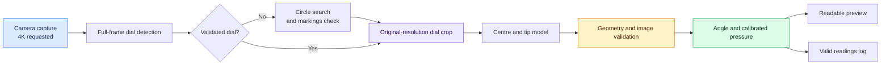

<a id="top"></a>

<div align="center">

# 🔍 Industrial Gauge Reader

### From a needle on a dial to a reading on your screen

**Capture · Detect · Validate · Measure**


[▶ Start](#setup-and-run) · [🎮 Controls](#live-controls) · [🧠 Models](#models-and-configuration) · [📊 Evaluate](#accuracy-evaluation) · [🗂 Structure](#project-structure)

</div>

Read UNIJIN and Badotherm pressure gauges using local YOLO models and OpenCV,
record readings, and evaluate predictions against independent reference values.

> **New here?** Install dependencies, launch the reader, select the correct gauge
> with **G**, and switch cameras with **V** if needed. The camera window must have
> focus for keyboard controls.

| Your next task | Jump to |
|---|---|
| Get a live reading | [Setup and run](#setup-and-run) |
| Read two gauges together | [Live controls](#live-controls) |
| Understand the detector | [Models and configuration](#models-and-configuration) |
| Save evidence and reference values | [Snapshots and logging](#snapshots-and-automatic-logging) |
| Check measurement accuracy | [Accuracy evaluation](#accuracy-evaluation) |
| Diagnose a missing reading | [Troubleshooting](#tests-and-troubleshooting) |

## How a frame becomes a reading



*The diagram shows the local detection path. If no dial crop is available, the
endpoint model can still inspect the full frame. A box alone does not establish
an accurate reading.*

---

## Setup and run

**Three steps: install → launch → select your gauge.**

Run these commands from the project root with Python 3.9 or newer, a connected
camera, and the required model files. `pyproject.toml` declares Python >=3.9.

```powershell
python -m pip install -r requirements.txt
python scripts/main_dual_gauge_reader.py
```

The current launchers configure their own import paths. Launch the scripts under
`scripts/`; the application code is under `src/gauge_reader/`.

Local inference is the default and does not require an API key. All configured
checkpoints must exist. Inference speed depends on hardware, model count, and
number of dial crops; there is no fixed frame-rate guarantee.

## Project structure

<details>
<summary><strong>🗂 Open the current project map</strong></summary>

```text
Gauge-Reader/
├── scripts/
│   ├── main_dual_gauge_reader.py   # Live loop, controls, snapshots and rendering
│   ├── evaluate_accuracy.py       # Saved-reading and photo evaluation
│   ├── calibrate_gauge.py         # Interactive scale-angle calibration
│   ├── train_log_calibration.py   # Fit pressure correction from labelled logs
│   └── preview.py                 # Preview helper used by script imports
├── src/gauge_reader/
│   ├── model_loader.py            # YOLO adapters, ensemble and dial-crop inference
│   ├── detection.py               # Pivot, shaft and tip geometry
│   ├── reading_quality.py         # Dial and needle evidence checks
│   ├── polar_reading.py           # Polar unwrap and radial pointer detection
│   ├── measurement.py             # Angle-to-pressure conversion
│   ├── tracking.py                # Acquisition, movement and freshness state
│   ├── dual_gauge_reader.py       # Independent left/right readings
│   ├── gauge_region.py            # Selected-region inference and coordinate mapping
│   ├── camera.py                  # Camera opening and resolution fallback
│   ├── preview.py                 # Package preview helper
│   ├── config.py                  # Profiles, backend and checkpoint paths
│   ├── scale_calibration.py       # Load and fit scale calibration
│   ├── dataset_snapshot.py        # Photos, diagnostics and labels CSV
│   └── auto_logger.py             # Periodic CSV and image logging
├── models/                        # Local .pt checkpoints and model notes
├── data/configs/gauge_calibration.json
├── logs/                          # Auto-log CSV and associated images
├── accuracy_data/                 # Evaluation photos, JSON and labels
├── accuracy_results/              # Evaluation reports when selected with --output
├── training_export/               # Training dataset exports
├── training_results/              # Training artifacts
├── tests/                         # Automated regression tests
├── docs/                          # Accuracy, local-model and polar guides
├── pyproject.toml                 # Package metadata and dependencies
├── requirements.txt
└── .env                           # Optional local configuration
```

</details>

## Models and configuration

<details>
<summary><strong>🧠 Explore checkpoints, class mapping and inference</strong></summary>

Settings are in [config.py](src/gauge_reader/config.py). Relative checkpoint paths
are resolved against the workspace, then `models/` by filename, then the package.
Absolute paths are also supported.

| Environment variable | Default |
|---|---|
| `MODEL_BACKEND` | `local` |
| `LOCAL_MODEL_PATH` | `best.pt` (also resolved from `models/best.pt`) |
| `LOCAL_OBB_PATHS` | `models/needle_obb_1.pt,models/needle_obb_2.pt` |
| `LOCAL_TIP_MODEL_PATH` | `models/needle_tips.pt` |

The ensemble supports ordinary and oriented boxes. It maps `centre`, `center`
and `pointer_centre` to `base`, and `pointer_end` to `tip`. Identical checkpoint
contents share inference rather than running twice.

Dial models first inspect the full capture with `imgsz=1024`. If no validated
model dial is found, a circle-based fallback searches for circular faces and
checks scale markings. Endpoint-only models then inspect dial crops from the
original capture, and their predictions are mapped back to capture coordinates.
Overlapping dial boxes are deduplicated for crop inference. If no dial crop is
available, endpoint models fall back to the full frame.

Centre/tip detections are associated within a dial before supplying needle
landmarks. Geometric and image-evidence checks still apply; a detection box is
not proof of a correct pressure reading.

For the cloud backend, configure `.env`:

```env
MODEL_BACKEND=roboflow
ROBOFLOW_API_KEY=your_api_key_here
```

The local ensemble and its circle/crop fallback belong to the local backend.

</details>

## Capture, preview and acquisition

| Capture for measurement | Preview for inspection |
|---|---|
| Original camera resolution | Fits within 1280×720 |
| Used by detection and validation | Large readings and gauge-detail inset |
| Saved in original snapshots | Resizing does not change measured coordinates |

The camera requests **3840×2160** first. If the reported dimensions do not match,
it requests **1920×1080**. The console and `Capture` overlay report the actual
size accepted by the camera, which may differ from either request.

Detection uses capture-resolution frames. Only the live preview is resized to
fit **1280×720**, preserving aspect ratio. Large reading panels are drawn after
resizing, and a gauge-detail inset is shown when crop bounds are available.
The inset is for inspection; it is not itself a detector input.

Current experimental acquisition settings:

- Single mode acquires the centre after **one** observation.
- Single and dual modes acquire an angle after **one valid fresh observation**.
- Movement confirmation still uses six observations; removing initial acquisition
  delay did not remove movement filtering or image validation.
- Cached predictions do not count as fresh observations.
- Single mode runs detection every two frames while acquiring and every four
  frames when tracked with confidence >=70.

Single-observation acquisition can increase fluctuations. Dial markings, needle
length, shaft contrast, calibrated scale and freshness checks remain enabled.
Missing tips, weak shafts and invalid dials can still prevent a reading.
Held values may appear with a `HELD` label; invalid, stale or held observations
are excluded from valid snapshot values and automatic logging.

## Supported profiles

| Gauge | Primary scale | Secondary scale | Single-mode default | Default evaluation tolerance |
|---|---|---|---|---|
| UNIJIN | 0–150 PSI | 0–10 kgf/cm² | Geometric angle | ±1.5 PSI |
| Badotherm | −1–15 bar | Secondary display off | Polar unwrap | ±0.16 bar |

Profile assignment is manual. Generic dial detections do not identify gauge brand
or pressure scale. Calibration overrides are loaded from
`data/configs/gauge_calibration.json`, with the legacy root-level file supported
as a fallback. Polar mode can help with scale interpretation but does not
guarantee immunity to perspective or reflection errors.

## Live controls

Use these keys with the camera window focused:

| Key | Action |
|---|---|
| `G` | Switch single-mode gauge profile and reset tracking |
| `P` | Toggle geometric angle / polar reading in single mode |
| `R` | Select a complete gauge region; Enter confirms, Esc cancels |
| `F` | Clear the selected region |
| `D` | Enter dual mode, or return to single mode |
| `X` | Swap left/right profiles in dual mode |
| `T` | Toggle available pressure correction |
| `A` | Toggle five-second auto-logging |
| `S` | Save a photo, detector image, diagnostics and labels row in single mode |
| `L` | Lock the centre and, when available, validated needle angle |
| `C` | Unlock and reacquire in single mode |
| `Z` | Calibrate zero from the current valid reading |
| `[` / `]` | Nudge scale angles by 0.5° |
| `V` | Switch between configured camera indices 0 and 1 |
| `Q` | Quit |

For dual mode, place UNIJIN left and Badotherm right, each completely inside its
half of the image. `X` reverses profile assignments and resets both trackers.
Dual mode does not use the single-mode `R` selection. Single-mode logging pauses
on entry; press `A` to enable dual logging.

Out-of-range validated needles produce an `Exceed gauge limit` status rather
than a numerical pressure. Single mode also attempts a Windows warning beep.

## Snapshots and automatic logging

Press `S` in single mode to save into:

| Profile | Photos and diagnostics | Labels |
|---|---|---|
| UNIJIN | `accuracy_data/unijin_photos/` | `accuracy_data/unijin_labels.csv` |
| Badotherm | `accuracy_data/badotherm_photos/` | `accuracy_data/badotherm_labels.csv` |

Each capture includes a clean original JPEG, a matching `_detector.jpg`, and JSON
diagnostics. The detector image uses the capture-sized overlay, so it differs
from the resized live panel and inset. CSV `expected` is left blank for an
independent reference; `live_predicted` is recorded only for a valid fresh reading.
Additional diagnostic and secondary-unit columns may be present.

Auto-logging starts off. `A` records valid primary readings every five seconds.
Because `logs/` exists in this layout, the default CSV is
`logs/readings_log.csv`; without that directory, it falls back to the workspace
root. Associated original images and JSON are stored beside the CSV under
`readings_log_images/`. Timestamps include Singapore's UTC+08:00 offset.

CSV fields are `timestamp,gauge_type,pressure,unit,image,reference_pressure`.
Fill `reference_pressure` independently, in the logged primary unit. Predictions
cannot supply their own ground truth. Held, stale, unavailable and out-of-range
readings are skipped. File errors stop logging while the reader continues.

## Accuracy evaluation

> **Availability ≠ accuracy.** A detected needle needs an independent pressure
> reference before its reading can be judged correct.

Run from the project root. These examples explicitly select the root
`accuracy_results/` directory; without `--output`, the evaluation script defaults
to `scripts/accuracy_results/`.

```powershell
# Evaluate values recorded when S was pressed; no model inference
python scripts/evaluate_accuracy.py accuracy_data/unijin_labels.csv --profile UNIJIN --live --output accuracy_results
python scripts/evaluate_accuracy.py accuracy_data/badotherm_labels.csv --profile Badotherm --live --output accuracy_results

# Reprocess photos independently
python scripts/evaluate_accuracy.py accuracy_data/unijin_labels.csv --profile UNIJIN --output accuracy_results

# Validate inputs or inspect options
python scripts/evaluate_accuracy.py accuracy_data/unijin_labels.csv --profile UNIJIN --live --check-only
python scripts/evaluate_accuracy.py --list-profiles
python scripts/evaluate_accuracy.py --help
```

Enter every `expected` value before evaluation. `--live` does not load models;
the cloud backend configuration still requires its API key if selected.
Photo evaluation does not reproduce live tracking history or manual locks.
Use `--polar` to request polar photo analysis.

Default tolerance is **1% of scale span**. For UNIJIN at 100 PSI, predictions
from **98.5 to 101.5 PSI** pass. For Badotherm at 1.30 bar, predictions from
**1.14 to 1.46 bar** pass. `--tolerance` overrides the allowance in primary units.

Reports include `summary.json`, `readings.csv`, and photo-mode overlays.
`accuracy_rate_percent` counts all samples; unavailable predictions count as
not passing. MAE, RMSE and bias use usable predictions only. A usable-reading
rate measures availability, not pressure accuracy.

## Calibration

<details>
<summary><strong>⚖️ Open calibration commands and correction notes</strong></summary>

```powershell
python scripts/calibrate_gauge.py
python scripts/train_log_calibration.py logs/readings_log.csv --distance-cm 100
python scripts/train_log_calibration.py logs/readings_log.csv --distance-cm 100 --save
```

Follow the interactive calibration script's displayed controls. Log correction
requires independently supplied reference pressures. The training script
currently writes its reports beneath `scripts/accuracy_results/`.

An available 100 cm pressure correction is provisional and specific to its
calibration setup. `T` toggles it; camera distance is not measured automatically.
Zero-tare and scale nudging remove the selected profile's correction. Pressure
correction changes angle-to-value conversion, not needle detection.

</details>

## Tests and troubleshooting

```powershell
python -m pip install pytest
python -m pytest -q
```

Tests cover geometry, tracking, quality checks, model adapters, regions, snapshots,
logging, calibration and evaluation. Automated checks do not establish real-world
accuracy; use independent reference samples at different pressures and distances.

| Symptom | Meaning / next check |
|---|---|
| `Local model not found` | Check the configured path and required files in `models/` |
| `needle tip unavailable` | No usable tip was found or a candidate failed validation |
| `insufficient scale markings` | The estimated dial ring failed the markings check; inspect centre, radius, focus and reflections |
| `dial clipped by frame` | The sampled ring extends outside the image; the estimated centre or radius may be wrong |
| Dial box but no pressure | Object detection succeeded, but measurement validation or tracking did not |
| Small text in saved detector image | Saved overlays retain capture resolution; the live preview has larger panels |
| Blank snapshot prediction | The reading was unavailable, invalid, held or stale |
| CSV write failure | Close applications locking the CSV and inspect console details |

Further guides: [Accuracy testing](docs/ACCURACY_TESTING.md),
[Local models](docs/LOCAL_MODEL.md), and [Polar reading](docs/POLAR_UNWRAPPING.md).
These supplementary guides may describe older settings; the paths and acquisition
settings above reflect the current implementation.

<details>
<summary><strong>✅ Open the capture-session checklist</strong></summary>

- [ ] Selected the correct gauge profile and camera.
- [ ] Kept the full dial visible and reduced reflections.
- [ ] Checked the actual capture resolution.
- [ ] Recorded independent reference pressures in the correct units.
- [ ] Included different pressures, distances and lighting conditions.
- [ ] Kept evaluation samples separate from calibration samples.

These are a printable checklist; checkbox interaction depends on the viewer.

</details>

---

<div align="center">

**See the needle. Check the evidence. Measure the error.**

[↑ Back to top](#top) · [Accuracy guide](docs/ACCURACY_TESTING.md) · [Model guide](docs/LOCAL_MODEL.md)

</div>

*Preview in VS Code with **Ctrl + Shift + V**. Collapsible sections work in
compatible Markdown viewers; Mermaid diagrams require renderer support.*
